# Study-gcode  

### index  

- 60x60.gcode // example gcode  

- 5 // rhino5 ghx  

  - ExportFile.ghx // テキストファイル書き出しのテスト用スクリプト、GH_CPython  

  - grid-ver1.ghx // 中心点からの距離に応じて変化量の変わるグリッド、線形での移動なのであまり可愛くない  

  - ~~Write-gcode-ver1.ghx~~  
    // 普通の四角形、G93 E0 の部分 Python 側で反映なかった X  
  - ~~Write-gcode-ver2.ghx // 普通の四角形~~  
    // 吐き出し量 E0 修正、速度指定 F4000 追加、gcode ファイル書き出し機能追加、スカート追加 X  
  - ~~Write-gcode-ver2-Desktop.ghx // 普通の四角形~~  
    // slab の卓上用に、無理やり書き換えた。とりあえずok  
  - Write-gcode-ver3.ghx  
    // 3D のポリラインのデータリストから、gcode に変換するように変えた。タイムスタンプと、必要なパラメータを冒頭にコメントを書けるようにした  


  cf.  
  アトラクタで膨らむグリッドを使って、真ん中がやわらかい感じ？  
    
  GH: GRID SPREADING  
  [http://formularch.blogspot.com/2012/06/gh-grid-spreading.html](http://formularch.blogspot.com/2012/06/gh-grid-spreading.html)  


---  

---  


### gcode syntax  


G0 Xnn Ynn Znn Enn Fnn Snn : 高速直線移動  
G1 Xnn Ynn Znn Enn Fnn Snn : 直線移動  


Xnn X軸上における移動先の位置  
Ynn Y軸上における移動先の位置  
Znn Z軸上における移動先の位置  
Enn 現在地点と移動先地点の間で押し出されるフィラメントの量  
Fnn 速さ的な、変えたいときにそこで宣言するだけでよい  

```gcode
; ex
G1 Z3.0　
G1 X1.25 Y2.5 E3.0 F2.0

```


G92: 位置を指定する(Set Position)

```gcode
G92 E0
```


---  


### Printing - 181022  

吐出量の調整が必要  
これは多すぎる  
卓上の 3D プリンタは、パスの length の 0.1 倍くらいの値が良さそう  
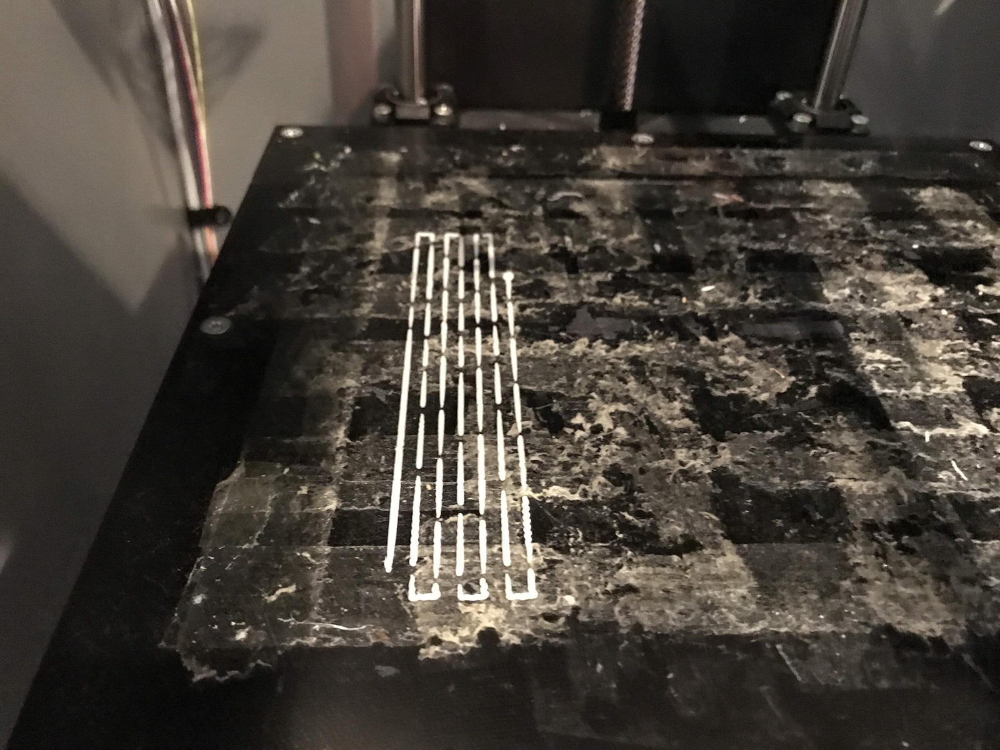  


成功した  
181022-Desktop.gcode  
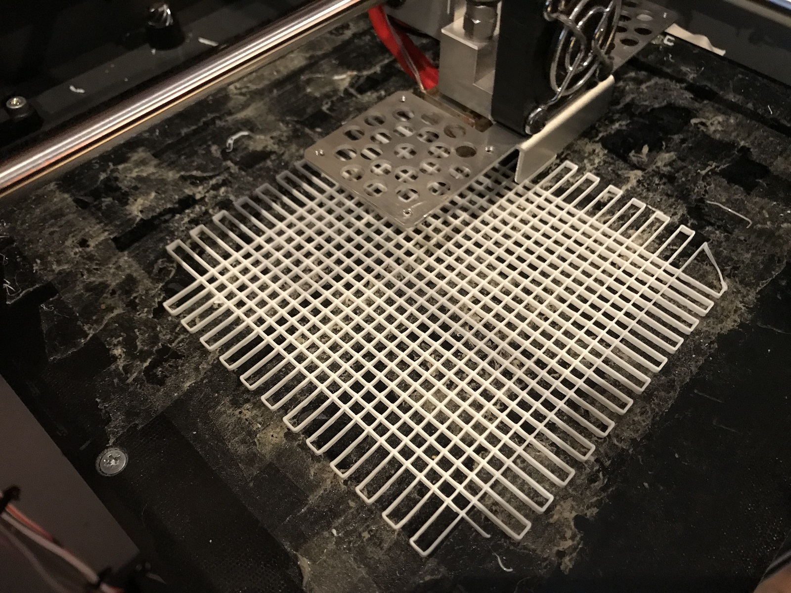  


---  


### gh-PointList to gcode  

Write-gcode-ver2.ghx までは、2次元パスに、ループ処理でZ座標を足しているんですけど、途中でカタチを変えてくのとかだと、2次元パスが単一ではないので、この方法は変えたほうがいい。  

現状（上の状態から）、3次元に配列したパス（データツリー）から gcode に変換、に実装し直す。  
これからはパスの方で3次元情報も与えて（2次元のパスを）書く方法に。

造形物の可視化もできるので一石二鳥  


---  


### ghPython で、Datatree  

マジでよくわからない  
今回は、とりあえず 30x50 のデータツリーを、  
Flatten した 1500 のリストにして、50 ずつ切り出して使った  

とりあえず OK  

なんか資料はあるけど  
[http://cu.t-ads.org/tips-datatree-in-python/](http://cu.t-ads.org/tips-datatree-in-python/)  

Grasshopper 1.0 (Rhino6) 以降は、TreeHelper とかいうのがあるっぽい  
```python
import ghpythonlib.treehelpers as th
```
[https://developer.rhino3d.com/guides/rhinopython/grasshopper-datatrees-and-python/](https://developer.rhino3d.com/guides/rhinopython/grasshopper-datatrees-and-python/)  


---  


### Printing - 181029  

ベットが綺麗になった。ガラスベットに。  
ちょっとはがれる  
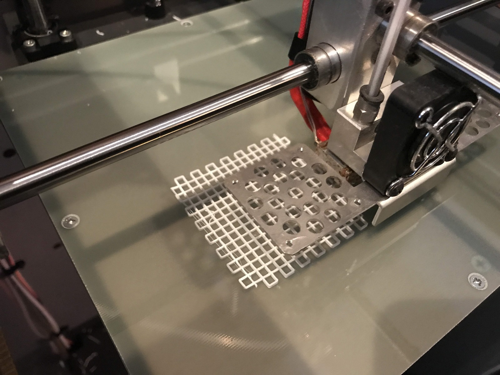

テスト。  
剥がれがあるものの、gcode は大丈夫そう。  
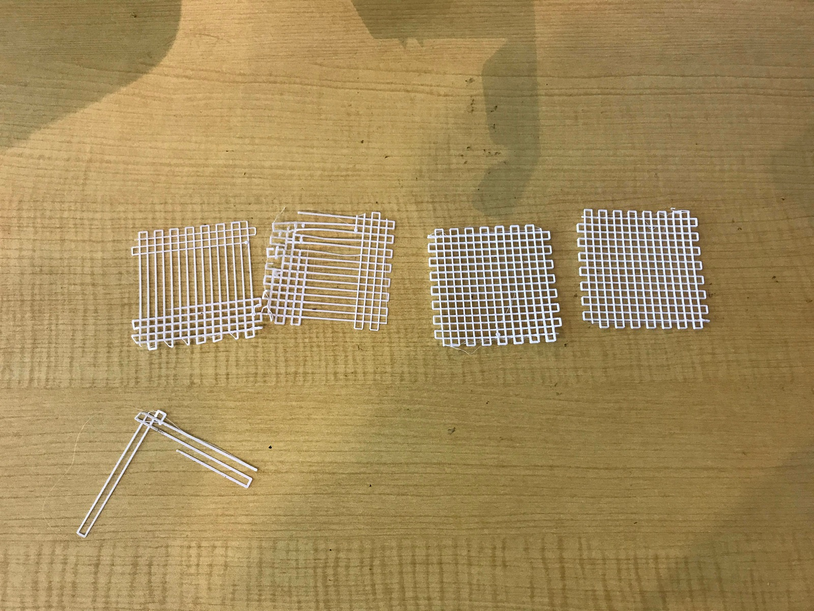  

靴のようなもののテスト。  
UV のサーフェスの走査パスから gcode。  
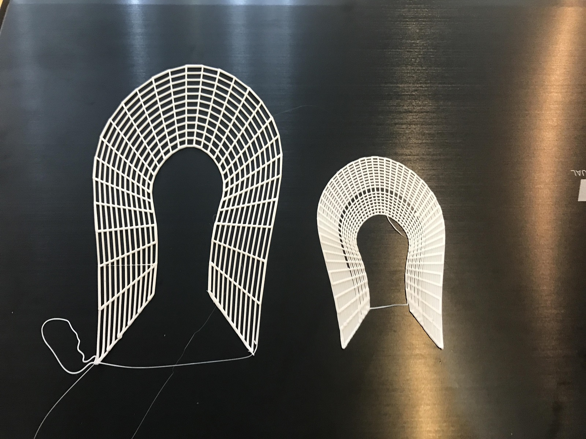  

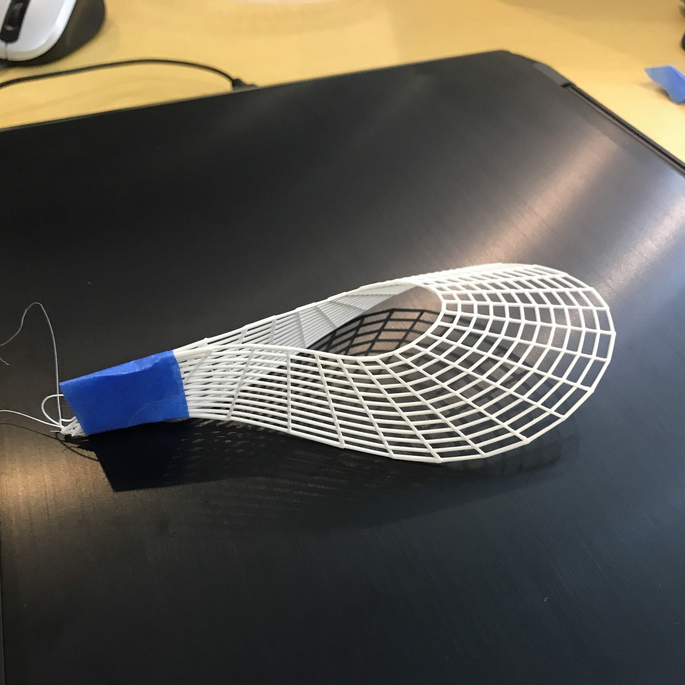  

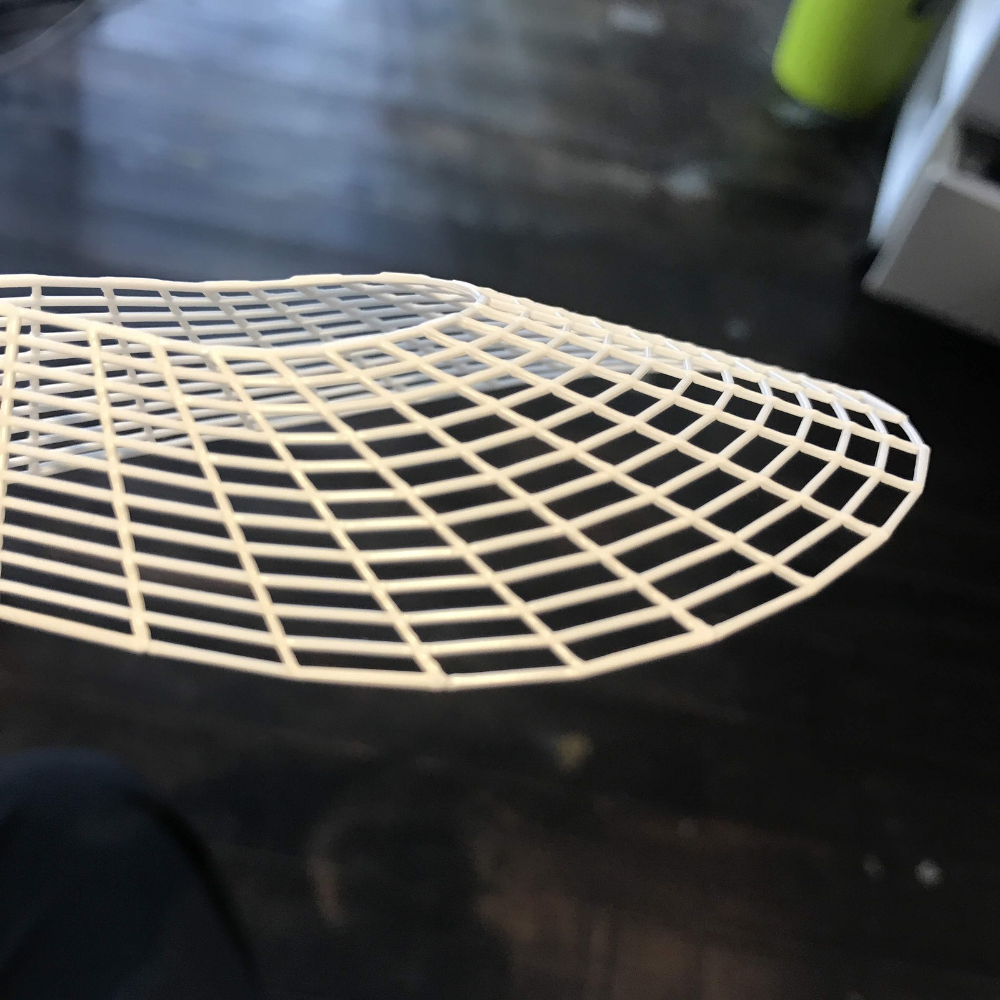  


cf.  
ナイキ初の3Dプリントによるシューズアッパー開発、ロンドンマラソンで披露  
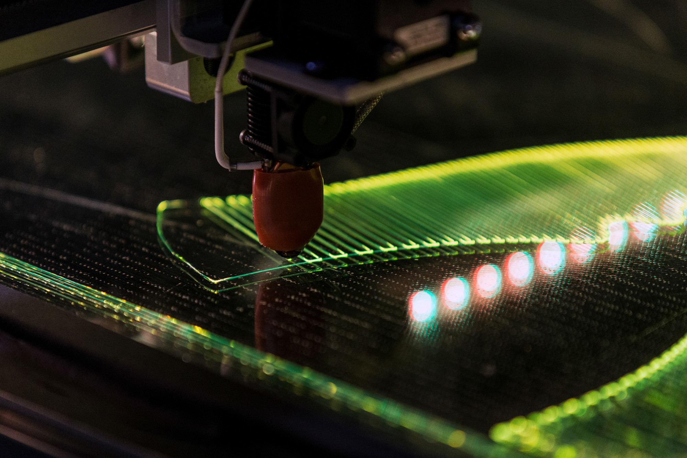  
[https://www.fashionsnap.com/article/2018-04-18/nike-flyprint/](https://www.fashionsnap.com/article/2018-04-18/nike-flyprint/)  


---  


### gcode Modeling??


普通の3Dプリント  
3D Brep → スライサー → プリント  
スライス工程がブラックボックス  

ここをハックするための、gcode 生成  

普通のスライスでは普通のものしか作れない  

現状はスライスしていない、良質なポリラインをつくっている、gcode Modeling  
良質なポリラインを、gcode に変換する    

応用例、案として  

- 縦は通常の PLA 、横はフレックス系の柔らかいもので重ねる  

- Z 方向にも移動して、曲面を仕上げる  

- 内部構造をコントロールした方向異方性を持った物体  

- 積み上げた向きには弱い、一本で行ければ強い。MarkForge のカーボンとか  

- 吐出量の調整で、ひものような陶器↓  
  
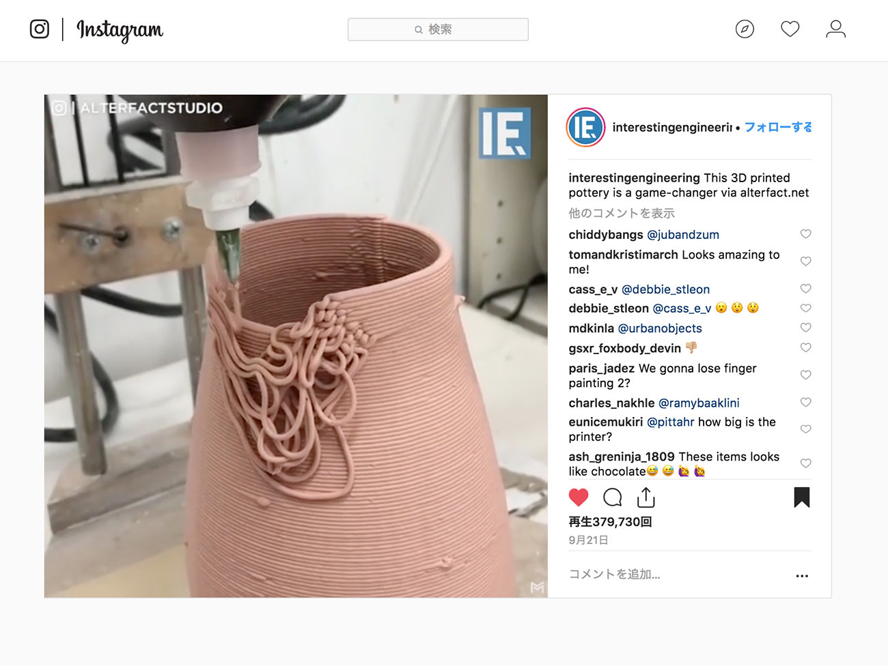  
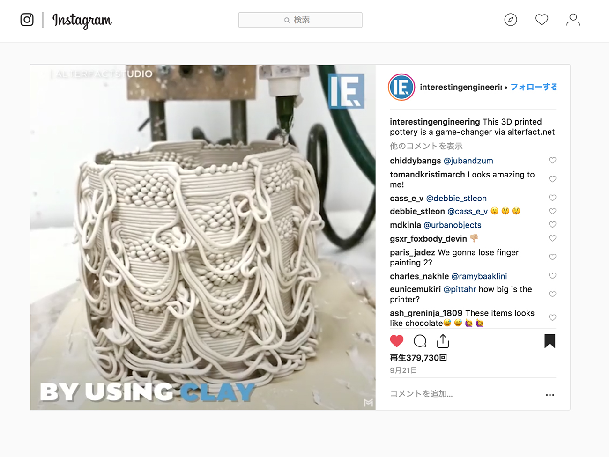  
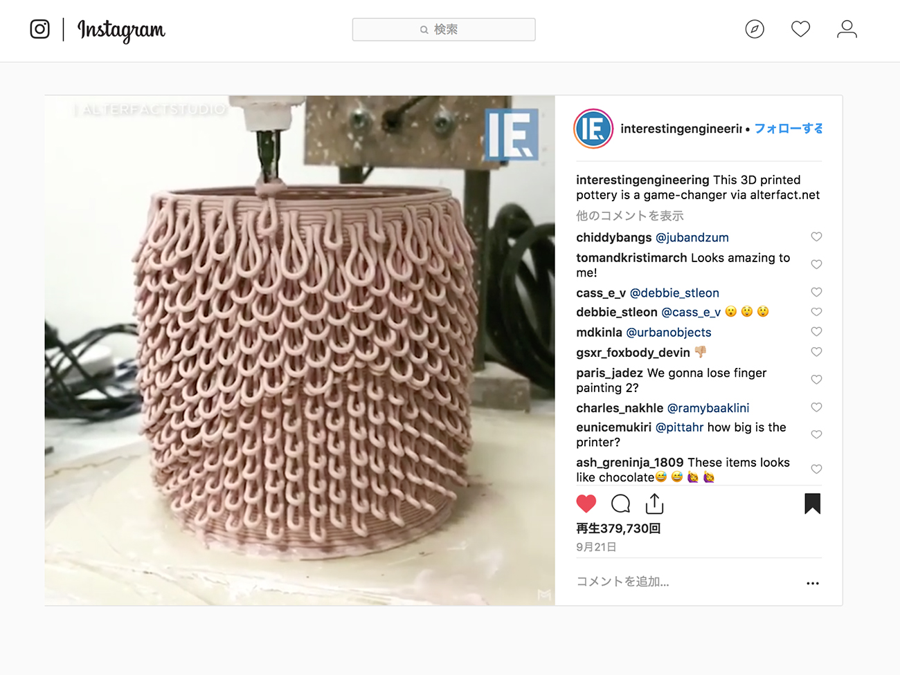  
[https://www.instagram.com/p/Bn_MkRNFoDC/?utm_source=ig_share_sheet&igshid=84wlgu7g9y2u&fbclid=IwAR2hwBIkCWpfYokgR3HTqiso7gF6-ca7bJ5GnXU8goyQNyb-bOicC6sbhhg](https://www.instagram.com/p/Bn_MkRNFoDC/?utm_source=ig_share_sheet&igshid=84wlgu7g9y2u&fbclid=IwAR2hwBIkCWpfYokgR3HTqiso7gF6-ca7bJ5GnXU8goyQNyb-bOicC6sbhhg)  

- 吐出量でのテクスチャや、毛の表現  
// FDM の gcode での表現等の研究をしている明治大学・高橋先生（[https://haruki.xyz/](https://haruki.xyz/)）  


---  

---


### Ref.  

G-code(RepRap community Wiki) // 本家（英語）  
[https://reprap.org/wiki/G-code](https://reprap.org/wiki/G-code)  

G-code(RepRap community Wiki) // 日本語版   
[https://reprap.org/wiki/G-code/ja](https://reprap.org/wiki/G-code/ja)  

Grasshopper の gcode 生成のアドオン、silkworm  
[https://projectsilkworm.com/](https://projectsilkworm.com/)  
[https://github.com/ProjectSilkworm/Silkworm](https://github.com/ProjectSilkworm/Silkworm)  

FDM の gcode での表現等の研究をしている明治大学・高橋先生  
[https://haruki.xyz/](https://haruki.xyz/)  
